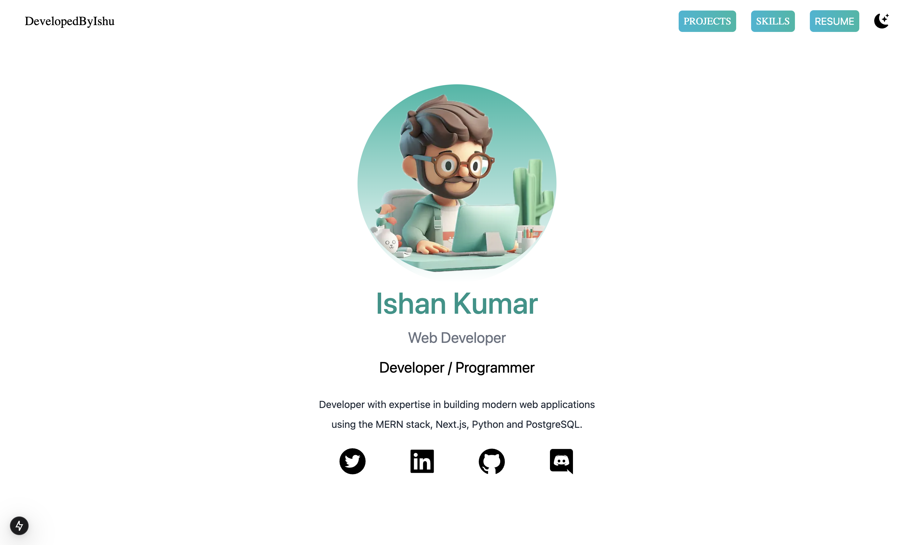

# ISHAN KUMAR

[](https://ishan-kumar.netlify.app)

[Visit](https://your-live-site-link.com](https://ishan-kumar.netlify.app))

A sleek and responsive portfolio website showcasing my skills, projects, and resume. Built with **Next.js** and styled using **Tailwind CSS** with dark mode support.

## Features
- Fully responsive design
- Light/Dark mode toggle
- Projects gallery with live demo links
- Skills and tools section
- Social media integration


## Technologies Used
- **Next.js**
- **Tailwind CSS**
- **React Icons**

## How to Run Locally
1. Clone the repository:
   ```bash
   git clone https://github.com/Allmight-456/portfolio.git
2. Change Directory:
   ```bash
   cd your-repo
2. Change Directory:
   ```bash
   cd your-repo
3. Install Dependency:
   ```bash
   npm install
4.Run
   ```bash
       npm run dev
